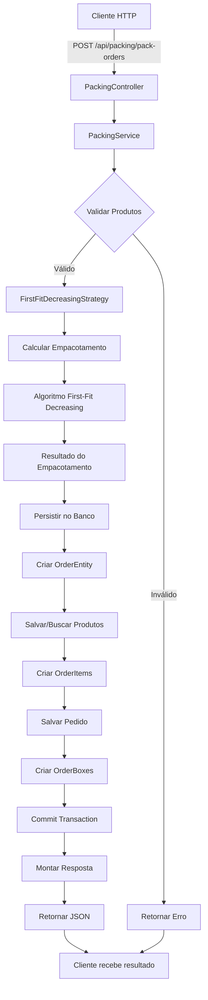
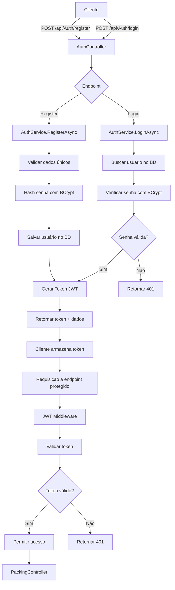
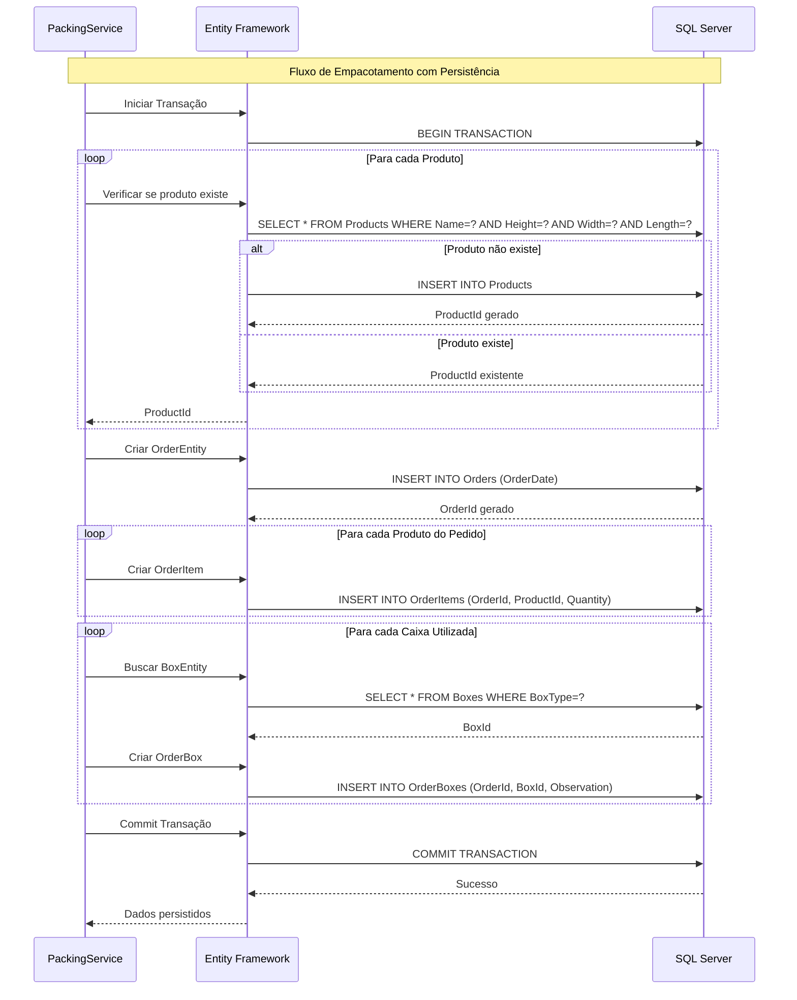
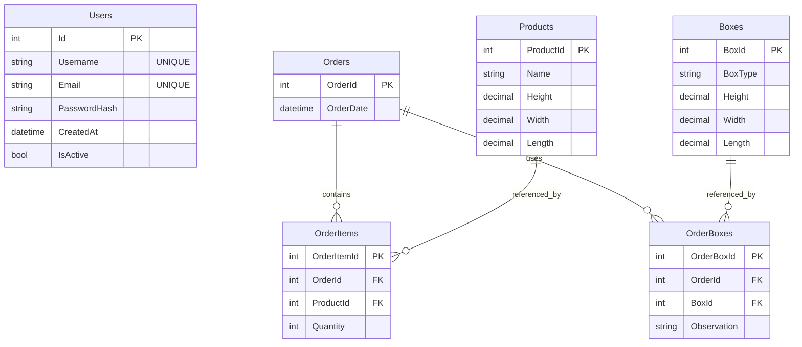
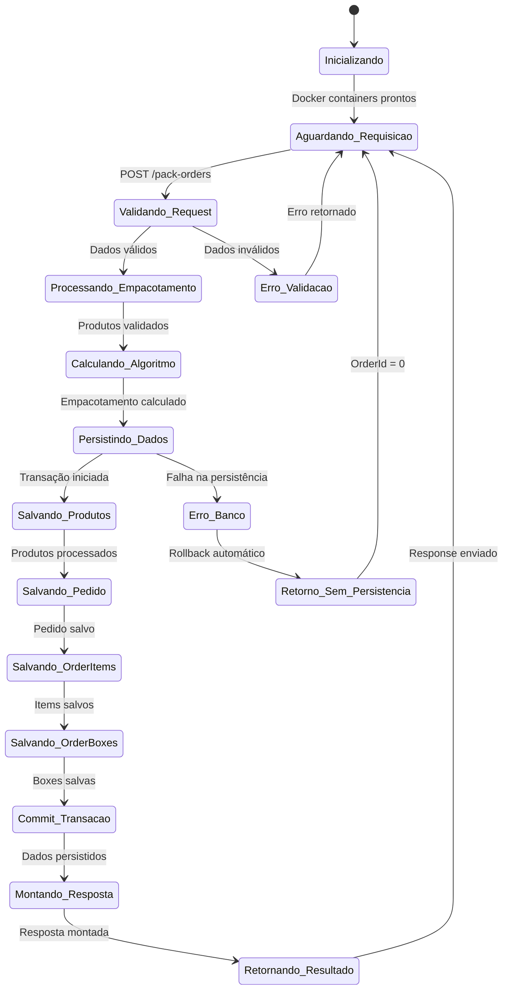
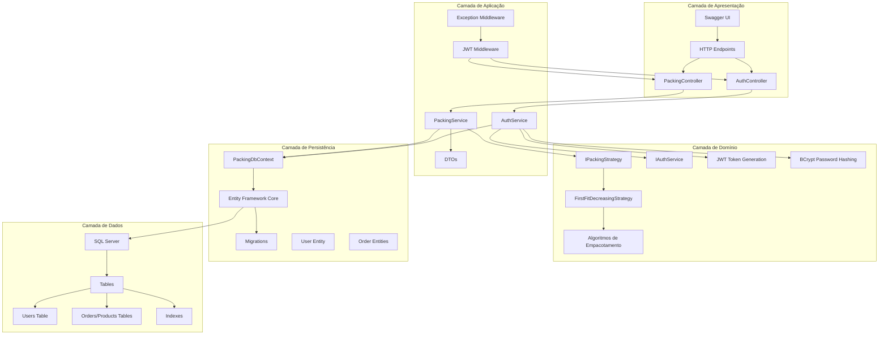

# PackingService API - Sistema de Empacotamento Inteligente com Autenticação JWT

## Descrição

O PackingService API é um microserviço desenvolvido em .NET 9 que automatiza o processo de empacotamento de pedidos com sistema de autenticação JWT integrado. A aplicação recebe uma lista de pedidos com produtos e suas dimensões, calcula a melhor forma de acomodá-los nas caixas disponíveis e persiste todas as informações no banco de dados SQL Server.

## Funcionalidades

- ✅ **Autenticação JWT**: Sistema completo de registro, login e autorização
- ✅ **Empacotamento Inteligente**: Algoritmo First-Fit Decreasing para otimizar o uso das caixas
- ✅ **Persistência Completa**: Salva pedidos, produtos, itens, caixas e usuários no banco de dados
- ✅ **API RESTful**: Endpoints documentados com Swagger para fácil integração
- ✅ **Gerenciamento de Usuários**: Sistema de cadastro e autenticação de usuários
- ✅ **Gerenciamento de Produtos**: Evita duplicação de produtos no banco
- ✅ **Rastreabilidade**: Cada pedido retorna um ID único para consultas futuras
- ✅ **Containerização**: Aplicação totalmente dockerizada
- ✅ **Testes Automatizados**: Suite completa de testes unitários e de integração
- ✅ **Documentação Swagger com JWT**: Interface gráfica para testar endpoints autenticados

## 🔐 Sistema de Autenticação

### Recursos de Segurança

- **JWT (JSON Web Tokens)** para autenticação stateless
- **BCrypt** para hash seguro de senhas
- **Bearer Token** authentication
- **Proteção de endpoints** sensíveis
- **Swagger integrado** com autenticação
- **Tokens com expiração** configurável (24h por padrão)

### Endpoints de Autenticação

| Endpoint                   | Método | Descrição               | Autenticação         |
| -------------------------- | ------ | ----------------------- | -------------------- |
| `/api/Auth/register`       | POST   | Registrar novo usuário  | Não requerida        |
| `/api/Auth/login`          | POST   | Fazer login             | Não requerida        |
| `/api/Packing/pack-orders` | POST   | Processar empacotamento | ✅ **JWT Requerido** |

## Caixas Disponíveis

| Tipo        | Dimensões (A x L x C) | Volume      |
| ----------- | --------------------- | ----------- |
| **Caixa 1** | 30 x 40 x 80 cm       | 96.000 cm³  |
| **Caixa 2** | 80 x 50 x 40 cm       | 160.000 cm³ |
| **Caixa 3** | 50 x 80 x 60 cm       | 240.000 cm³ |

## Tecnologias Utilizadas

- **.NET 9** - Framework principal
- **SQL Server 2022** - Banco de dados
- **Entity Framework Core** - ORM para acesso aos dados
- **JWT Bearer Authentication** - Sistema de autenticação
- **BCrypt.Net** - Hash seguro de senhas
- **Docker & Docker Compose** - Containerização
- **Swagger/OpenAPI** - Documentação da API com autenticação
- **xUnit** - Framework de testes
- **FluentAssertions** - Assertions para testes

## Pré-requisitos

Antes de executar a aplicação, certifique-se de ter:

### Obrigatórios:

- **Docker Desktop** (versão 4.0+)
  - [Download para Windows](https://docs.docker.com/desktop/install/windows-install/)
  - [Download para macOS](https://docs.docker.com/desktop/install/mac-install/)
  - [Download para Linux](https://docs.docker.com/desktop/install/linux-install/)

### Opcionais (para desenvolvimento):

- **.NET 9 SDK** - [Download](https://dotnet.microsoft.com/download/dotnet/9.0)
- **Visual Studio 2022** ou **VS Code**
- **SQL Server Management Studio (SSMS)** - para acessar o banco diretamente

## 🚀 Início Rápido

### 1. Clone e Execute

```bash
# Clone o repositório
git clone <https://github.com/Cysne/PackingService.Api.git>
cd PackingService.Api

# Execute com Docker
docker-compose up --build
```

### 2. Acesse a Aplicação

- **Swagger UI**: http://localhost:5000/swagger
- **API Base URL**: http://localhost:5000
- **SQL Server**: localhost:14330

### 3. Teste a Autenticação

#### 3.1. Registrar um novo usuário

```bash
curl -X POST "http://localhost:5000/api/Auth/register" \
  -H "Content-Type: application/json" \
  -d '{
    "username": "admin",
    "email": "admin@teste.com",
    "password": "123456"
  }'
```

#### 3.2. Fazer login

```bash
curl -X POST "http://localhost:5000/api/Auth/login" \
  -H "Content-Type: application/json" \
  -d '{
    "username": "admin",
    "password": "123456"
  }'
```

#### 3.3. Usar o token retornado

Copie o `token` da resposta do login e use nos próximos endpoints.

## 🔑 Como Autenticar

### Via Swagger (Recomendado)

1. **Acesse**: http://localhost:5000/swagger
2. **Registre-se ou faça login**: Use os endpoints `/api/Auth/register` ou `/api/Auth/login`
3. **Copie o token**: Da resposta JSON, copie apenas o valor do campo `token`
4. **Clique em "Authorize"**: Botão verde no topo da página do Swagger
5. **Cole apenas o token**: **NÃO inclua "Bearer "**, cole apenas o token puro
6. **Clique em "Authorize"**: No modal que abriu
7. **Feche o modal**: Agora você está autenticado

### Via cURL

```bash
# Substitua SEU_TOKEN_AQUI pelo token obtido no login
curl -X POST "http://localhost:5000/api/Packing/pack-orders" \
  -H "Authorization: Bearer SEU_TOKEN_AQUI" \
  -H "Content-Type: application/json" \
  -d '[{
    "orderId": 1,
    "products": [
      {
        "name": "Produto Teste",
        "height": 10,
        "width": 15,
        "length": 20
      }
    ]
  }]'
```

### ⚠️ Importante sobre Tokens

- **No Swagger**: Cole **APENAS o token**, sem "Bearer "
- **No cURL/Postman**: Use **"Bearer " + token**
- **Expiração**: Tokens expiram em 24 horas por padrão
- **Renovação**: Faça login novamente para obter um novo token

## 📚 Guia de Uso da API

### 1. Autenticação (Endpoints Públicos)

#### Registrar Usuário

```http
POST /api/Auth/register
Content-Type: application/json

{
  "username": "meuusuario",
  "email": "usuario@email.com",
  "password": "minhasenha123"
}
```

**Resposta:**

```json
{
  "token": "eyJhbGciOiJIUzI1NiIsInR5cCI6IkpXVCJ9...",
  "username": "meuusuario",
  "email": "usuario@email.com",
  "expiresAt": "2025-05-31T15:30:00Z"
}
```

#### Fazer Login

```http
POST /api/Auth/login
Content-Type: application/json

{
  "username": "meuusuario",
  "password": "minhasenha123"
}
```

**Resposta:** (mesmo formato do registro)

### 2. Empacotamento (Endpoint Protegido)

#### Processar Pedidos

```http
POST /api/Packing/pack-orders
Authorization: Bearer SEU_TOKEN_AQUI
Content-Type: application/json

[
  {
    "orderId": 123,
    "products": [
      {
        "name": "Smartphone",
        "height": 15,
        "width": 8,
        "length": 2
      },
      {
        "name": "Carregador",
        "height": 10,
        "width": 5,
        "length": 3
      }
    ]
  }
]
```

**Resposta:**

```json
[
  {
    "order_id": 123,
    "boxes": [
      {
        "box_id": "Caixa 1",
        "products": ["Smartphone", "Carregador"],
        "observation": null
      }
    ]
  }
]
```

## Estrutura Atualizada do Banco de Dados

A aplicação agora cria automaticamente as seguintes tabelas:

### Users (Nova!)

- `Id` (PK) - ID único do usuário
- `Username` - Nome de usuário único
- `Email` - Email único do usuário
- `PasswordHash` - Hash BCrypt da senha
- `CreatedAt` - Data de criação do usuário
- `IsActive` - Status ativo do usuário

## Estrutura do Banco de Dados

A aplicação cria automaticamente as seguintes tabelas:

### Orders

- `OrderId` (PK) - ID único do pedido
- `OrderDate` - Data/hora do pedido

### Products

- `ProductId` (PK) - ID único do produto
- `Name` - Nome do produto
- `Height`, `Width`, `Length` - Dimensões do produto

### OrderItems

- `OrderItemId` (PK) - ID único do item
- `OrderId` (FK) - Referência ao pedido
- `ProductId` (FK) - Referência ao produto
- `Quantity` - Quantidade do produto

### Boxes

- `BoxId` (PK) - ID único da caixa
- `BoxType` - Tipo da caixa (Caixa P, M, G)
- `Height`, `Width`, `Length` - Dimensões da caixa

### OrderBoxes

- `OrderBoxId` (PK) - ID único da relação
- `OrderId` (FK) - Referência ao pedido
- `BoxId` (FK) - Referência à caixa
- `Observation` - Observações do empacotamento

## Configuração de Ambiente

### Variáveis de Ambiente (docker-compose.yml)

```yaml
# SQL Server
SA_PASSWORD: "Your_password123"
ACCEPT_EULA: "Y"

# Connection String da API
ConnectionStrings__DefaultConnection: "Server=sqlserver,14330;Database=PackingDb;User ID=sa;Password=Your_password123;TrustServerCertificate=true"

# JWT Configuration (opcional - valores padrão já configurados)
Jwt__Key: "SuperSecretKeyWithAtLeast32Characters123!"
Jwt__Issuer: "PackingService.Api"
Jwt__Audience: "PackingService.Api"
```

### Configurações de Segurança JWT

- **Chave JWT**: Configurada por padrão, pode ser sobrescrita via variável de ambiente
- **Expiração**: 24 horas por padrão
- **Algoritmo**: HMAC SHA-256
- **Claims incluídos**: Username, Email, Sub, Jti, Iat

### Portas Utilizadas

- **API**: 5000 (HTTP)
- **SQL Server**: 14330 (mapeada externamente)
- **Swagger UI**: 5000/swagger

## Comandos Úteis

### Parar os Containers

```bash
docker-compose down
```

### Reconstruir e Reiniciar

```bash
docker-compose up --build --force-recreate
```

### Ver Logs da API

```bash
docker-compose logs packingservice
```

### Ver Logs do SQL Server

```bash
docker-compose logs sqlserver
```

### Executar Testes

```bash
# Se tiver .NET SDK instalado localmente
dotnet test

# Ou via Docker
docker build -f Dockerfile.test -t packingservice-tests .
docker run --rm packingservice-tests
```

## Executando Testes

### Pré-requisitos para Testes

- .NET 9 SDK instalado localmente

### Executar Todos os Testes

```bash
dotnet test PackingService.Api.Tests/
```

### Executar com Relatório de Cobertura

```bash
dotnet test --collect:"XPlat Code Coverage"
```

### Tipos de Testes Inclusos

- **Testes Unitários**: Validam a lógica de empacotamento
- **Testes de Integração**: Testam a API completa com banco em memória
- **Testes de Edge Cases**: Cenários extremos e casos limites
- **Testes de Performance**: Validam performance com grandes volumes

## Solução de Problemas

### Erro: "Porta já está em uso"

```bash
# Verifica quais portas estão sendo usadas
netstat -an | findstr 5000
netstat -an | findstr 14330

# Para containers órfãos
docker-compose down --remove-orphans
```

### Erro: "Falha na conexão com SQL Server"

```bash
# Verifica se o container SQL está healthy
docker-compose ps

# Reinicia apenas o SQL Server
docker-compose restart sqlserver
```

### Erro: "Migration falhou"

```bash
# Remove volumes do Docker e recria
docker-compose down -v
docker-compose up --build
```

### Problemas de Autenticação JWT

#### Erro 401 "Unauthorized" no Swagger

1. **Verifique se fez login**: Use `/api/Auth/login` primeiro
2. **Copie apenas o token**: Não inclua "Bearer " no Swagger
3. **Token expirado**: Faça login novamente se passou de 24h
4. **Clique em "Authorize"**: Botão verde no topo do Swagger

#### Erro "The signature key was not found"

```bash
# Reinicie a aplicação para recarregar as configurações JWT
docker-compose restart packingservice
```

#### Token não funciona em cURL/Postman

```bash
# Certifique-se de incluir "Bearer " no header Authorization
curl -H "Authorization: Bearer SEU_TOKEN" ...
```

#### Usuário já existe

- **Problema**: Tentativa de registrar username/email duplicado
- **Solução**: Use um username/email diferente ou faça login com as credenciais existentes

## Monitoramento e Logs

### Verificar Health dos Containers

```bash
docker-compose ps
```

### Acompanhar Logs em Tempo Real

```bash
docker-compose logs -f packingservice
```

### Acessar Container da API

```bash
docker exec -it packingservice bash
```

### Acessar SQL Server via sqlcmd

```bash
docker exec -it sqlserver /opt/mssql-tools18/bin/sqlcmd -S localhost -U sa -P "Your_password123" -C
```

## Arquitetura e Fluxos

### Fluxo Principal da Aplicação



### Fluxo de Autenticação JWT



### Comunicação com Banco de Dados



### Modelo de Dados (Relacionamentos)



### Fluxo de Estados da Aplicação



### Arquitetura de Camadas



## Recursos Adicionais

### Swagger UI

- URL: http://localhost:5000/swagger
- Documentação interativa completa da API
- Permite testar endpoints diretamente

### Estrutura do Projeto

```plaintext
PackingService.Api/
├── PackingService.Api/
│   ├── Controllers/      # Controllers da API
│   ├── Data/             # Contexto do Entity Framework
│   ├── DTOs/             # Data Transfer Objects
│   ├── Entities/         # Entidades do banco de dados
│   ├── Migrations/       # Migrações do Entity Framework
│   ├── Middleware/       # Middlewares customizados (ex: ExceptionMiddleware)
│   ├── Properties/       # Configurações do projeto (ex: launchSettings.json)
│   ├── Services/         # Lógica de negócio
│   ├── strategies/       # Algoritmos de empacotamento
│   └── ...               # Outros arquivos e pastas
├── PackingService.Api.Tests/ # Testes automatizados (unitários e integração)
└── docker-compose.yml    # Orquestração Docker
```

---
