# PackingService API - Sistema de Empacotamento Inteligente

## Descrição

O PackingService API é um microserviço desenvolvido em .NET 9 que automatiza o processo de empacotamento de pedidos. A aplicação recebe uma lista de pedidos com produtos e suas dimensões, calcula a melhor forma de acomodá-los nas caixas disponíveis e persiste todas as informações no banco de dados SQL Server.

## Funcionalidades

- ✅ **Empacotamento Inteligente**: Algoritmo First-Fit Decreasing para otimizar o uso das caixas
- ✅ **Persistência Completa**: Salva pedidos, produtos, itens e caixas utilizadas no banco de dados
- ✅ **API RESTful**: Endpoint documentado com Swagger para fácil integração
- ✅ **Gerenciamento de Produtos**: Evita duplicação de produtos no banco
- ✅ **Rastreabilidade**: Cada pedido retorna um ID único para consultas futuras
- ✅ **Containerização**: Aplicação totalmente dockerizada
- ✅ **Testes Automatizados**: Suite completa de testes unitários e de integração

## Caixas Disponíveis

| Tipo        | Dimensões (A x L x C) | Volume     |
| ----------- | --------------------- | ---------- |
| **Caixa P** | 10 x 15 x 20 cm       | 3.000 cm³  |
| **Caixa M** | 15 x 20 x 25 cm       | 7.500 cm³  |
| **Caixa G** | 20 x 25 x 30 cm       | 15.000 cm³ |

## Tecnologias Utilizadas

- **.NET 9** - Framework principal
- **SQL Server 2022** - Banco de dados
- **Entity Framework Core** - ORM para acesso aos dados
- **Docker & Docker Compose** - Containerização
- **Swagger/OpenAPI** - Documentação da API
- **xUnit** - Framework de testes
- **FluentAssertions** - Assertions para testes

## Pré-requisitos

Antes de executar a aplicação, certifique-se de ter:

### Obrigatórios:

- **Docker Desktop** (versão 4.0+)
  - [Download para Windows](https://docs.docker.com/desktop/install/windows-install/)
  - [Download para macOS](https://docs.docker.com/desktop/install/mac-install/)
  - [Download para Linux](https://docs.docker.com/desktop/install/linux-install/)

### Opcionais (para desenvolvimento):

- **.NET 9 SDK** - [Download](https://dotnet.microsoft.com/download/dotnet/9.0)
- **Visual Studio 2022** ou **VS Code**
- **SQL Server Management Studio (SSMS)** - para acessar o banco diretamente

## Como Executar a Aplicação

### 1. Clone o Repositório

```bash
git clone <seu-repositorio>
cd PackingService.Api
```

### 2. Inicie os Containers

```bash
docker-compose up --build
```

### 3. Aguarde a Inicialização

O processo criará automaticamente:

- Container SQL Server na porta `14330`
- Container da API na porta `5000`
- Banco de dados `PackingDb` com todas as tabelas
- Dados de seed (caixas disponíveis e produtos de exemplo)

### 4. Verifique se está Funcionando

- **API**: http://localhost:5000
- **Swagger UI**: http://localhost:5000/swagger

## Como Usar a API

### Endpoint Principal

```
POST /api/packing/pack-orders
Content-Type: application/json
```

### Exemplo de Requisição

```json
[
  {
    "products": [
      {
        "name": "Produto Exemplo",
        "height": 8,
        "width": 12,
        "length": 16
      },
      {
        "name": "Outro Produto",
        "height": 5,
        "width": 10,
        "length": 15
      }
    ]
  }
]
```

### Exemplo de Resposta

```json
[
  {
    "order_id": 2,
    "boxes": [
      {
        "box_id": "Caixa M",
        "products": ["Produto Exemplo", "Outro Produto"],
        "observation": null
      }
    ]
  }
]
```

## Estrutura do Banco de Dados

A aplicação cria automaticamente as seguintes tabelas:

### Orders

- `OrderId` (PK) - ID único do pedido
- `OrderDate` - Data/hora do pedido

### Products

- `ProductId` (PK) - ID único do produto
- `Name` - Nome do produto
- `Height`, `Width`, `Length` - Dimensões do produto

### OrderItems

- `OrderItemId` (PK) - ID único do item
- `OrderId` (FK) - Referência ao pedido
- `ProductId` (FK) - Referência ao produto
- `Quantity` - Quantidade do produto

### Boxes

- `BoxId` (PK) - ID único da caixa
- `BoxType` - Tipo da caixa (Caixa P, M, G)
- `Height`, `Width`, `Length` - Dimensões da caixa

### OrderBoxes

- `OrderBoxId` (PK) - ID único da relação
- `OrderId` (FK) - Referência ao pedido
- `BoxId` (FK) - Referência à caixa
- `Observation` - Observações do empacotamento

## Configuração de Ambiente

### Variáveis de Ambiente (docker-compose.yml)

```yaml
SA_PASSWORD: "Your_password123"
ACCEPT_EULA: "Y"
ConnectionStrings__DefaultConnection: "Server=sqlserver,14330;Database=PackingDb;User ID=sa;Password=Your_password123;TrustServerCertificate=true"
```

### Portas Utilizadas

- **API**: 5000 (HTTP)
- **SQL Server**: 14330 (mapeada externamente)

## Comandos Úteis

### Parar os Containers

```bash
docker-compose down
```

### Reconstruir e Reiniciar

```bash
docker-compose up --build --force-recreate
```

### Ver Logs da API

```bash
docker-compose logs packingservice
```

### Ver Logs do SQL Server

```bash
docker-compose logs sqlserver
```

### Executar Testes

```bash
# Se tiver .NET SDK instalado localmente
dotnet test

# Ou via Docker
docker build -f Dockerfile.test -t packingservice-tests .
docker run --rm packingservice-tests
```

## Executando Testes

### Pré-requisitos para Testes

- .NET 9 SDK instalado localmente

### Executar Todos os Testes

```bash
dotnet test PackingService.Api.Tests/
```

### Executar com Relatório de Cobertura

```bash
dotnet test --collect:"XPlat Code Coverage"
```

### Tipos de Testes Inclusos

- **Testes Unitários**: Validam a lógica de empacotamento
- **Testes de Integração**: Testam a API completa com banco em memória
- **Testes de Edge Cases**: Cenários extremos e casos limites
- **Testes de Performance**: Validam performance com grandes volumes

## Solução de Problemas

### Erro: "Porta já está em uso"

```bash
# Verifica quais portas estão sendo usadas
netstat -an | findstr 5000
netstat -an | findstr 14330

# Para containers órfãos
docker-compose down --remove-orphans
```

### Erro: "Falha na conexão com SQL Server"

```bash
# Verifica se o container SQL está healthy
docker-compose ps

# Reinicia apenas o SQL Server
docker-compose restart sqlserver
```

### Erro: "Migration falhou"

```bash
# Remove volumes do Docker e recria
docker-compose down -v
docker-compose up --build
```

### Limpar Cache do Docker

```bash
docker system prune -a
docker volume prune
```

## Monitoramento e Logs

### Verificar Health dos Containers

```bash
docker-compose ps
```

### Acompanhar Logs em Tempo Real

```bash
docker-compose logs -f packingservice
```

### Acessar Container da API

```bash
docker exec -it packingservice bash
```

### Acessar SQL Server via sqlcmd

```bash
docker exec -it sqlserver /opt/mssql-tools18/bin/sqlcmd -S localhost -U sa -P "Your_password123" -C
```

## Arquitetura e Fluxos

### Fluxo Principal da Aplicação


### Comunicação com Banco de Dados

```mermaid
sequenceDiagram
    participant API as PackingService
    participant EF as Entity Framework
    participant DB as SQL Server

    Note over API, DB: Fluxo de Empacotamento com Persistência

    API->>EF: Iniciar Transação
    EF->>DB: BEGIN TRANSACTION

    loop Para cada Produto
        API->>EF: Verificar se produto existe
        EF->>DB: SELECT * FROM Products WHERE Name=? AND Height=? AND Width=? AND Length=?

        alt Produto não existe
            EF->>DB: INSERT INTO Products
            DB-->>EF: ProductId gerado
        else Produto existe
            DB-->>EF: ProductId existente
        end

        EF-->>API: ProductId
    end

    API->>EF: Criar OrderEntity
    EF->>DB: INSERT INTO Orders (OrderDate)
    DB-->>EF: OrderId gerado

    loop Para cada Produto do Pedido
        API->>EF: Criar OrderItem
        EF->>DB: INSERT INTO OrderItems (OrderId, ProductId, Quantity)
    end

    loop Para cada Caixa Utilizada
        API->>EF: Buscar BoxEntity
        EF->>DB: SELECT * FROM Boxes WHERE BoxType=?
        DB-->>EF: BoxId

        API->>EF: Criar OrderBox
        EF->>DB: INSERT INTO OrderBoxes (OrderId, BoxId, Observation)
    end

    API->>EF: Commit Transação
    EF->>DB: COMMIT TRANSACTION

    DB-->>EF: Sucesso
    EF-->>API: Dados persistidos
```



### Modelo de Dados (Relacionamentos)


### Fluxo de Estados da Aplicação


### Arquitetura de Camadas


## Recursos Adicionais

### Swagger UI

- URL: http://localhost:5000/swagger
- Documentação interativa completa da API
- Permite testar endpoints diretamente

### Estrutura do Projeto

```
PackingService.Api/
├── Controller/          # Controllers da API
├── Data/               # Contexto do Entity Framework
├── DTOs/               # Data Transfer Objects
├── Entities/           # Entidades do banco de dados
├── Migrations/         # Migrações do Entity Framework
├── Services/           # Lógica de negócio
├── Strategies/         # Algoritmos de empacotamento
└── Tests/              # Testes automatizados
```

## Contribuição

1. Fork o projeto
2. Crie uma branch (`git checkout -b feature/nova-funcionalidade`)
3. Commit suas mudanças (`git commit -am 'Adiciona nova funcionalidade'`)
4. Push para a branch (`git push origin feature/nova-funcionalidade`)
5. Abra um Pull Request

## Licença

Este projeto está sob a licença MIT. Veja o arquivo LICENSE para mais detalhes.

---

**✅ Status**: Aplicação funcional com persistência completa no banco de dados
